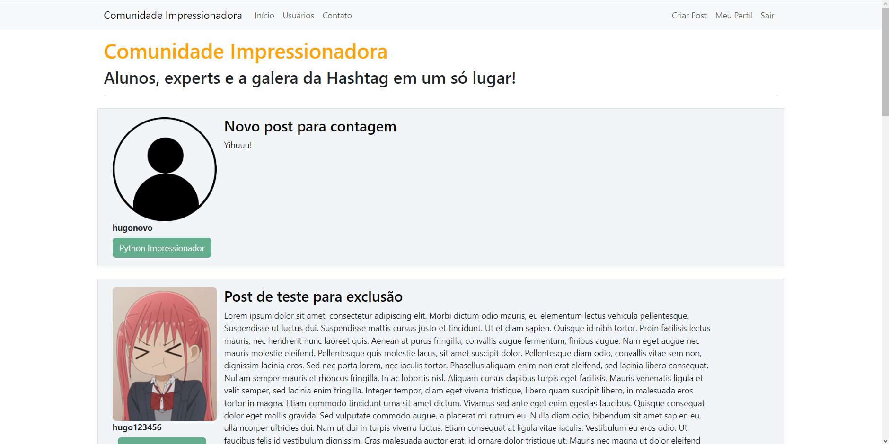
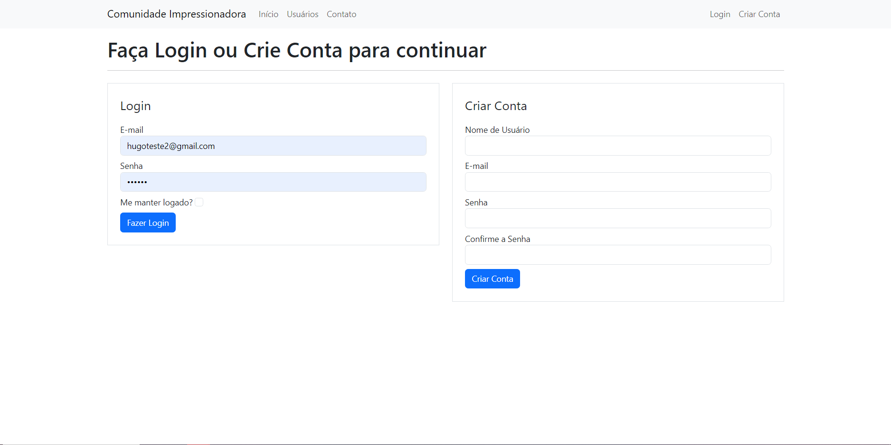
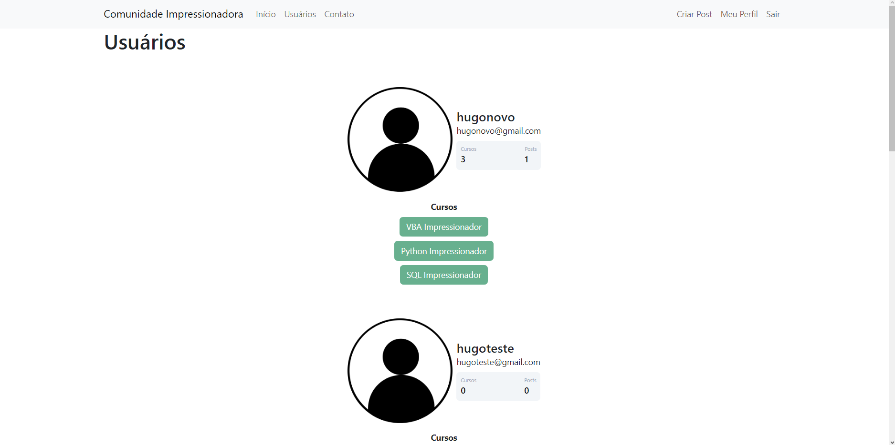
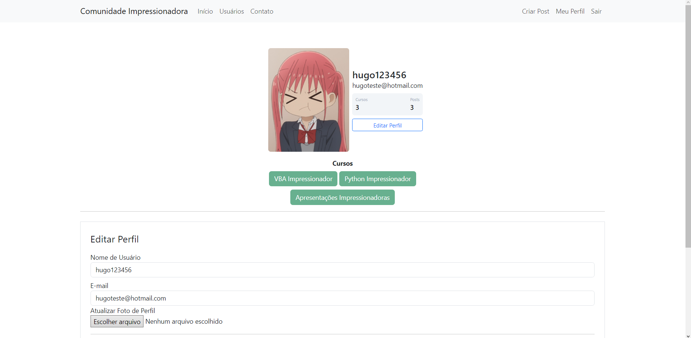
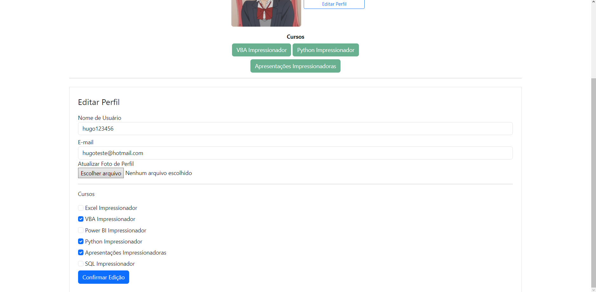
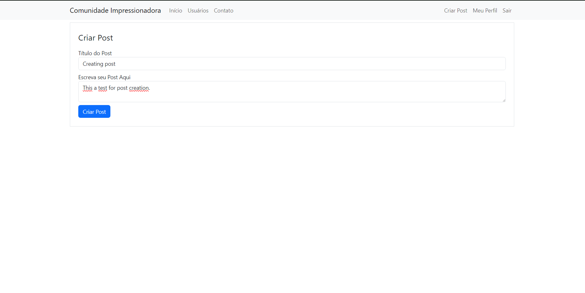
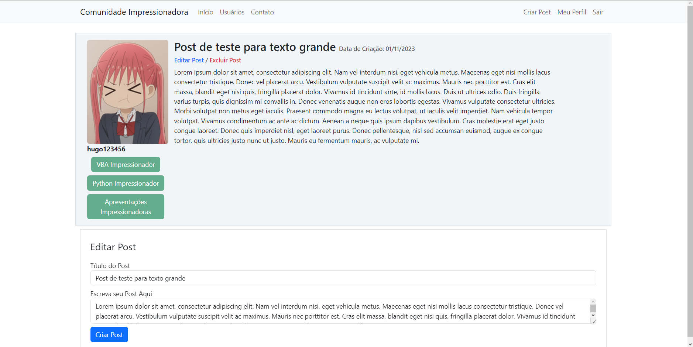

# Community Website Project

### Packages used:
+ flask
+ flask_sqlalchemy
+ flask_bcrypt
+ flask_login
+ flask_wtf
+ wtforms
+ wtforms.validators
+ PIL
+ secrets
+ translate
+ datetime
+ os

## Project Description

This a Web Development Project where the back-end was created using Flask framework and the
front-end was created using Bootstrap, a free open-source front-end development framework
for websites and web apps.

## Project Structure
+ The "main.py" file is responsible for running the website application while "init.py"
initializes the website's configurations such as getting database URL, secret key for password
encryption and also responsible for the database creation on cloud application deployment;

+ "models.py" contains the User and Post objects creating their respective attributes, each User
has the possibility of create, edit or delete multiple Post instances which will all be displayed
at the website's mainpage or the user's personal page;

+ "forms.py" creates the form objects such as login form, create account form and post form,
while the "routes.py" file defines each route that is related to each html page such as login/create account
page route being related to both the "FormLogin()" and "FormCriarConta()" object and to "login.html";

## Deployment

The final step is the deployment in which case the Railway infrastructure platform was used as it
allows for free website deployments for simple applications.

## Website's Homepage

## Login/Create Account Page

## Visualize all Users

## Edit Profile's Picture and Info

## Creating a new Post

## Editing/Deleting an existing Post
